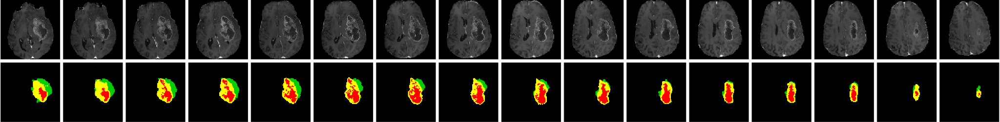
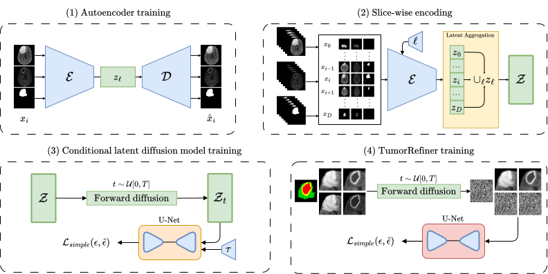

## Multi-Modal Slice-Based Latent Diffusion for Data Augmentation in Tumor Segmentation
<p align="center">
  
</p>

- Official repository for [3D multimodal MRI synthesis with conditional slice-based latent diffusion models for data augmentation in tumor segmentation](https://doi.org/10.1016/j.compmedimag.2025.102532).    
- This repository is based on my previous work on MRI synthesis [Arksyd96/synthesis-with-slice-based-ldm](https://github.com/Arksyd96/synthesis-with-slice-based-ldm).
- <b>This code version is a first prototype</b> that allowed me to get fast results to publish the paper. I'll rework it and improve it for a general purpose use case.

## Overview
<p align="center">
  
</p>

Multimodal imaging is essential for accurate tumor segmentation, but the scarcity of annotated data limits deep learning applications. Traditional augmentation techniques often fall short due to the complexity of 3D medical data.

We introduce a slice-based latent diffusion model that generates high-quality 3D multimodal MRI volumes along with their segmentation masks in a computationally efficient way. Our approach:

- Generates images slice-by-slice while maintaining spatial coherence using positional encoding and a Latent Aggregation module.
- Conditions the model on tumor characteristics to produce diverse tumor variations.
- Includes a refinement module to enhance image texture and reduce blurriness.

#### Results
Tested on the BRATS2021 dataset, our method outperforms existing diffusion models in tumor segmentation tasks, demonstrating improved efficiency and accuracy. While focused on brain tumors, this approach can be adapted to other medical imaging applications.

## Citation
If you find this work useful or use it in your research, please consider citing us
```bibtex
@article{kebaili2025multi,
  title={Multi-modal MRI synthesis with conditional latent diffusion models for data augmentation in tumor segmentation},
  author={Kebaili, Aghiles and Lapuyade-Lahorgue, J{\'e}r{\^o}me and Vera, Pierre and Ruan, Su},
  journal={Computerized Medical Imaging and Graphics},
  pages={102532},
  year={2025},
  publisher={Elsevier}
}